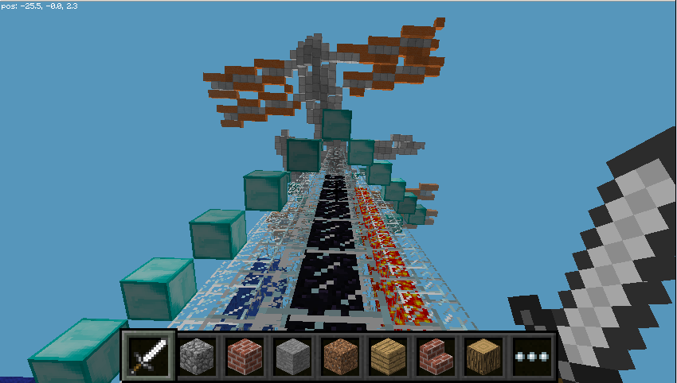

# Exploring Space with Minecraft

In this resource you will explore SpaceCRAFT, the Primary School [winning entry in the Astro Pi competition](https://astro-pi.org/competition/winners/).

SpaceCRAFT was conceived by Hannah Belshaw of Cumnor Girls School and created by [Martin O'Hanlon](http://www.stuffaboutcode.com) for the [Raspberry Pi Foundation](https://www.raspberrypi.org) 

SpaceCRAFT is a way of viewing data captured by the Astro Pi computer on the ISS in Minecraft. 

## Requirements

### Hardware

This resource requires a Raspberry Pi with a Sense HAT and a Raspbian SD card .

### Software

Minecraft and the Sense HAT software has been installed by default in Raspbian since September 2015.

If you do not have Minecraft: Pi Edition installed, or you need to test it works, see the [software installation](http://www.raspberrypi.org/learning/getting-started-with-minecraft-pi/software.md) page in the "Getting Started ..." resources.

If you havent installed the Sense HAT on your Raspberry Pi, you should review [Sense HAT installation and documentation](https://www.raspberrypi.org/documentation/hardware/sense-hat/).

You will also need to [install the SpaceCRAFT python library and programs](worksheets/installspacecraft.md).

### Learning

If you are new to programming Minecraft: Pi Edition, and want to extend SpaceCRAFT you should complete ["Getting Started With Programming The Minecraft World"](http://www.raspberrypi.org/learning/getting-started-with-minecraft-pi/), this isn't essential though.

## Worksheets

1. [Installing SpaceCRAFT](worksheets/installspacecraft.md)
2. [Exploring the Astro Pi computer using Minecraft](worksheets/interactiveastropi.md)
3. [Displaying data from Space in Minecraft](worksheets/displayingrealtimedata.md)
4. [Capturing data](worksheets/capturingdata.md)
5. [Playing back data](worksheets/playbackdata.md)
6. [Creating your own Minecraft display](worksheets/minecraftdisplay.md) - Coming soon

## Licence

Unless otherwise specified, everything in this repository is covered by the following licence:

***Exploring Space with Minecraft*** by [Martin O'Hanlon](http://www.stuffaboutcode.com) and the [Raspberry Pi Foundation](http://www.raspberrypi.org) is licenced under a [Creative Commons Attribution 4.0 International Licence](http://creativecommons.org/licenses/by-sa/4.0/).
