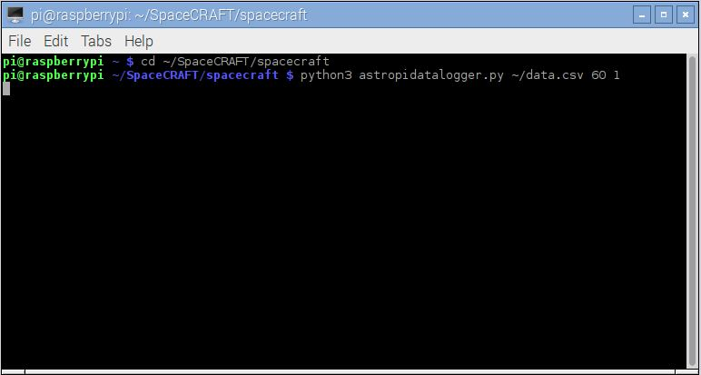

## Run the data capture program

The SpaceCRAFT data capture program needs to be run from the command line and passed a number of parameters telling it how long to run for, how often to read data, and where to create the data file.

Open a terminal by clicking `Menu > Accessories > Terminal` and enter the following commands to run a short test, which will capture data to a file called `data.csv` for 60 seconds, every 1 second:

```
cd ~/SpaceCRAFT/spacecraft
python3 astropidatalogger.py ~/data.csv 60 1
```



While the program is running, an animation created by Hannah Belshaw will be shown on the Sense HAT LED matrix; the pattern changes each time data is read from the sensors and written to the file.

The program will run for 60 seconds.

