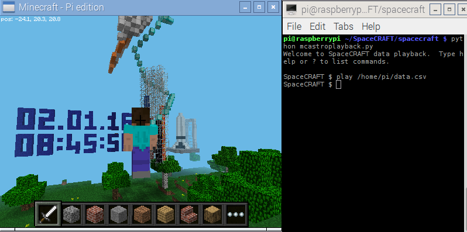

## Playing back the data in a file

Download the [SpaceCRAFT data file](https://raw.githubusercontent.com/raspberrypilearning/exploring-space-with-minecraft/master/data/SpaceCRAFT_20160209_104426.csv) which was created on the ISS, or use the [data capture program](capturing-data-from-the-sense-hat) to create a data file, then use the `play` command and the full file path of the data file to start the Minecraft display, for example:

```
play /home/pi/data.csv
```



