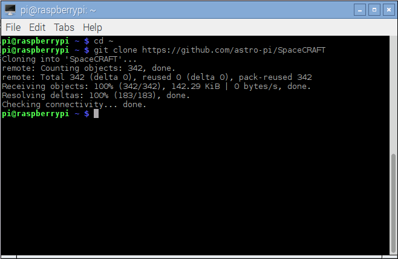
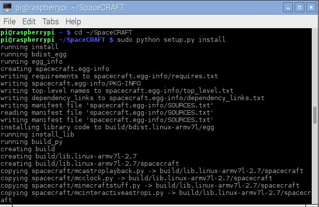

## What you will need
### Hardware
* Sense Hat
### Softward
# Software installation

The SpaceCRAFT programs and Python module need to be downloaded and installed before they can be used.

## Download

Open a terminal by clicking the icon on the taskbar, or by clicking 'Menu > Accessories > Terminal', and enter the following commands one by one, pressing `Enter` after each:

```bash
cd ~
git clone https://github.com/astro-pi/SpaceCRAFT
```



## Install the Python library

As well as the SpaceCRAFT programs, a Python library is also included to allow you to create your own SpaceCRAFT programs.

Open a terminal and enter the following commands:

```bash
cd ~/SpaceCRAFT
sudo python setup.py install
sudo python3 setup.py install
```



The SpaceCRAFT program and module documentation is [here](https://github.com/astro-pi/SpaceCRAFT/blob/master/README.rst).
