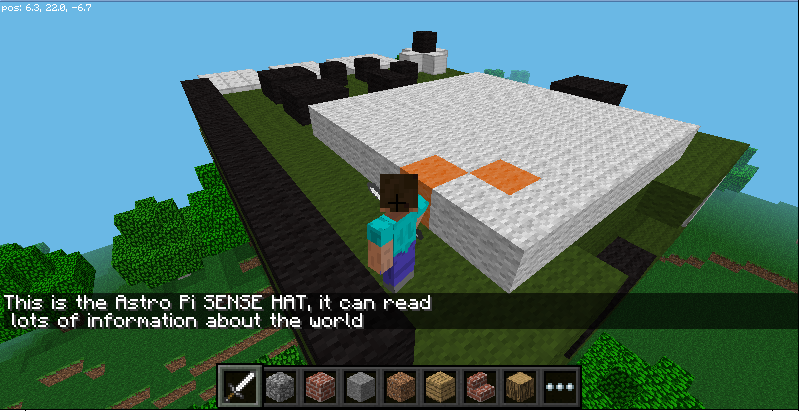

## Exploring the Sense HAT in Minecraft

SpaceCRAFT includes a program which creates an interactive Sense HAT and Raspberry Pi computer in Minecraft. This is a great way to explore your Raspberry Pi computer, its Sense HAT and what it can do.


[Video of the Minecraft Interactive Astro Pi](https://youtu.be/2OJeBvv7m-I).

### Start Minecraft

--- task ---

Run Minecraft by clicking **Menu**, **Games**, **Minecraft Pi**.

--- /task ---

--- task ---

Click `Start Game` and enter a world by either double-clicking a world you have already created or selecting **Create new**.

--- /task ---
 
--- task ---

Leave Minecraft running but press **Escape** to go to the menu and release your mouse pointer.

--- /task ---

### Run the interactive Sense HAT program

--- task ---

Open a terminal by clicking the icon on the taskbar, or by clicking **Menu**, **Accessories**, **Terminal**, and enter the following commands:

```
cd ~/SpaceCRAFT/spacecraft
python3 mcinteractiveastropi.py
```

--- /task ---

The interactive Sense HAT will be created directly above the player's position. If you go back to Minecraft and look up, you should see the bottom of the Raspberry Pi. 

--- task ---

Explore the Sense HAT in Minecraft, fly up and have a look around. 

Double-tap **Space** to fly, press **Space** to make the player go up, and press **Shift** to make the player come down.

--- /task ---

--- task ---

Interact with the Astro Pi by hitting it (right-clicking) with a sword. 

Every part of the Sense HAT computer can be hit and when you do, a message will be displayed in Minecraft telling you about what you hit.  



--- /task ---