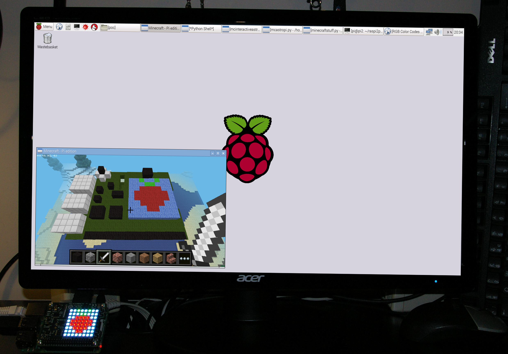

--- challenge ---

## Challenge: Can you find all of the parts on the Sense HAT?

### Sensors

If you hit the sensors, a message will appear in Minecraft, telling you what sensor it is and its current value.

Scout around and see if you can find all of the sensors - temperature, humidity, pressure, accelerometer, magnetometer, and gyroscope.

### LED matrix

Using the Sense HAT in Minecraft you can make the LED matrix on your Sense HAT light up. When you hit the LED matrix in Minecraft, the colour of the blocks will change and the LED will change to the same colour.

### Joystick

The joystick can also be hit, and will move the Sense HAT around the Minecraft world. 

--- /challenge ---

