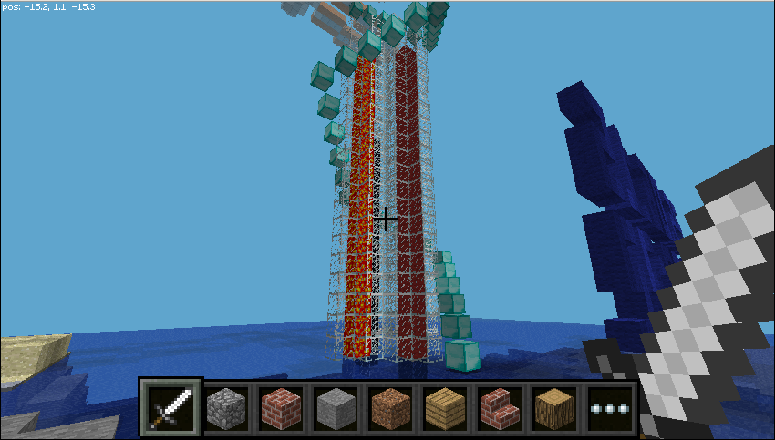
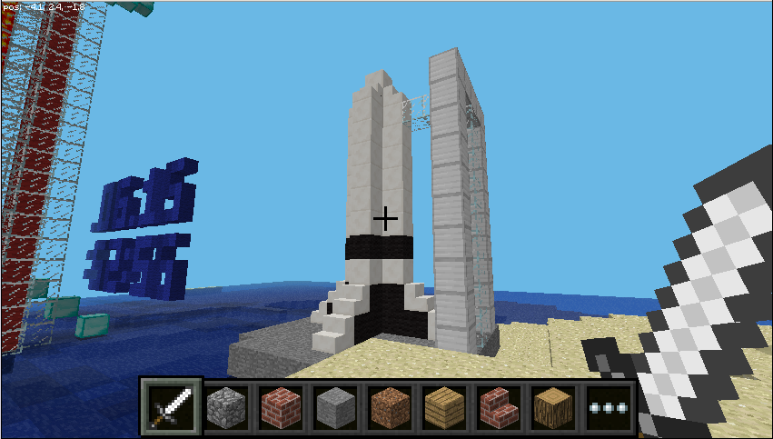

## Display live data

SpaceCRAFT displays data from the Sense HAT in Minecraft, converting the data into 3D structures and blocks.


You can run this program at any time, and it will use live data from the Sense HAT, allowing you to see results instantly in Minecraft.

--- task ---

Start Minecraft, enter a world, and press <kbd>Escape</kbd> to go to the menu.

--- /task ---

--- task ---

Open a terminal by clicking **Menu** > **Accessories** > **Terminal**, and enter the following commands one by one, pressing <kbd>Enter</kbd> after each command:

```
cd ~/SpaceCRAFT/spacecraft
python3 mcastrorealtime.py
```

--- /task ---

The SpaceCRAFT display will be created in front of the player's position. If you go back to Minecraft and look up, you will see the ISS.

### The four pillars

The four pillars running up the centre of the display show data from the temperature, humidity, and pressure sensors on the Sense HAT, and its CPU temperature.



Along the centre of each pillar is a different type of block representing the different sensors:

* Lava – temperature
* Water – humidity
* Obsidian – pressure
* Red wool – CPU temperature 

--- task ---

Hold your finger over the temperature sensor or breathe on the humidity sensor, and see what effect it has on the level of lava or water in the pillars.

--- /task ---

### The ISS

The ISS at the top of the stairs that circle the pillars changes position based on the orientation of the Sense HAT. Its movement is calculated using the Sense HAT's accelerometer, gyroscope, and magnetometer.


--- task ---

Tilt the Sense HAT and see the effect on the ISS.


--- /task ---


### The date and time
A large clock on the left of the display shows the date and time. When running live, it will show the current time set on your computer; when playing back collected data, it will show when the information was captured.


The date and time are displayed in the format DD.MM.YY HH:MM:SS (day, month, year; hours, minutes, seconds).

### Rocket

The rocket will be launched when the joystick is used.

--- task ---

Click the joystick on the Sense HAT to launch the the rocket.

--- /task ---


