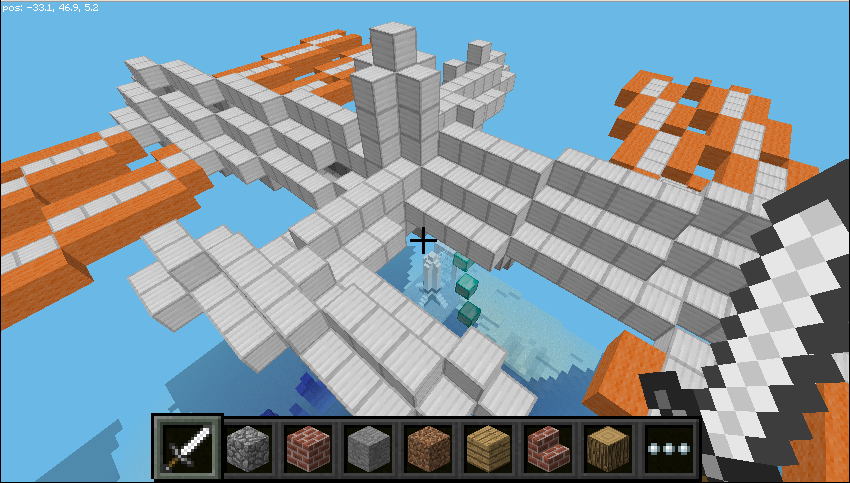
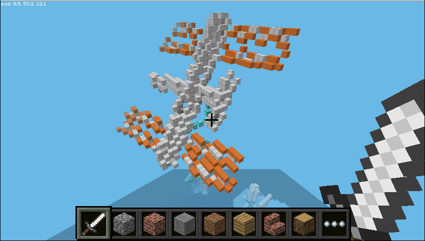

## SpaceCRAFT - display live data

SpaceCRAFT displays data from the SenseHAT in Minecraft, converting the data into 3D structures and blocks.


This can be run at any time and will use live data from the SenseHAT, allowing you to see the results instantly in Minecraft.

--- task ---

Start Minecraft, enter a world and press **Escape** to go to the menu.

--- /task ---

--- task ---

Open a terminal by clicking **Menu**, **Accessories**, **Terminal**, and enter the following commands one by one, pressing `Enter` after each command:

```
cd ~/SpaceCRAFT/spacecraft
python3 mcastrorealtime.py
```

--- /task ---

The SpaceCRAFT display will be created in front of the player's position. If you go back to Minecraft and look up, you will see the ISS.

### The four pillars

The four pillars running up the centre of the display show data from the temperature, humidity and pressure sensors on the Sense HAT and its CPU temperature.


Along the centre of each pillar is a different type of block representing the different sensors:

* Lava - temperature
* Water - humidity
* Obsidian - pressure
* Red wool - CPU temperature 

--- task ---

Holding your finger over the temperature sensor or breath on the humidity sensor, and see what effect it has on the level of lava or water in the pillars.

--- /task ---

### The ISS

The ISS at the top of the stairs which circle the pillars changes position based on the orientation of the Sense HAT. This is calculated using the Sense HAT's accelerometer, gyroscope, and magnetometer.



--- task ---

Tilt the Sense HAT and see the effect it has on the ISS.



--- /task ---


### The date and time

The date and time is displayed by a large clock on the left of the display. When run live, it will show the current time set on the computer; when playing back data capture from the ISS, it will show the date and time the information was captured.


The date and time is displayed in the format DD.MM.YY HH:MM:SS (day . month . year  hours : minutes : seconds).

### Rocket

The rocket will be launched when the joystick is used.

--- task ---

Click the joystick on the Sense HAT to see the rocket launch.

--- /task ---


