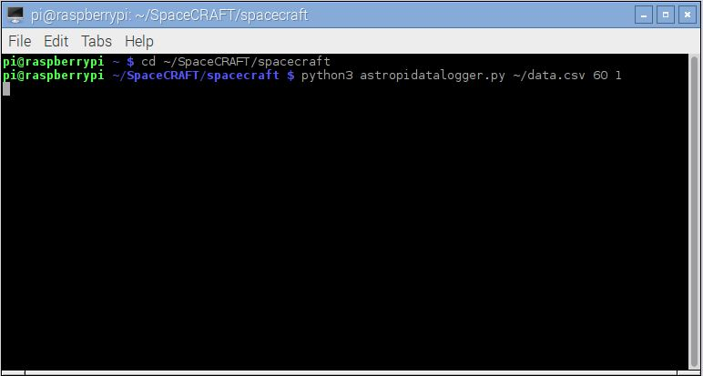

## Capturing data from the Sense HAT

During the [Principia](https://astro-pi.org/principia/) mission, ESA astronaut [Tim Peake](http://timpeake.esa.int/) ran the SpaceCRAFT data capture program for a week. 

The SpaceCRAFT program created a [file of data](resources/SpaceCRAFT_20160209_104426.csv) from all the Sense HAT's sensors, and this was sent back to Earth. You can use the file to see what conditions were like on the ISS while it ran.

You can use your Raspberry Pi and Sense HAT in the same way to capture data about your environment, whether that's in your home, classroom, or anywhere else you want to set it up.

### Run the data capture program

The SpaceCRAFT data capture program is run from the command line. You need to pass it a number of parameters telling it how long to run for, how often to read data, and where to create the data file.

--- task ---

Open a terminal window by clicking **Menu* > **Accessories** > **Terminal** and enter the following commands to run a short test that will capture data to a file called `data.csv` for 60 seconds, taking a reading every second:

```
cd ~/SpaceCRAFT/spacecraft
python3 astropidatalogger.py ~/data.csv 60 1
```



--- /task ---

While the program is running, an animation created by Hannah Belshaw is shown on the Sense HAT LED matrix. The pattern changes each time data is read from the sensors and written to the file.

The test will run for 60 seconds.

--- collapse ---

---
title: Data capture options 
---

The data capture program requires you to pass it a number of parameters that tell it how to run and where to save the data. Run the program using the parameter `-h`, like this: 

```
python3 astropidatalogger.py -h
```

It will now display all of the available parameter options:

```
usage: astropidatalogger.py [-h] [-v] filename timetorun interval

Sense HAT Data Logger

positional arguments:
	filename       The output filename
	timetorun      The time in seconds the logger should run for
	interval       The time in seconds between each write

optional arguments:
	-h, --help     show this help message and exit
	-v, --verbose  Output verbose debug statements

```

When you tested the data capture program, you passed it three parameters:

1. filename - `~/data.csv`
1. timetorun - `60`
1. interval - `1`

The program cannot run without these parameters, and you can change their values to suit your needs. For example, you can make it write to a different file, run for longer, or read data less often. To run the program so that it writes to a file called `hannahsdata.csv` for 30 minutes (1800 seconds) and reads data once a minute (60 seconds), you would use this command:

```
python3 astropidatalogger.py ~/hannahsdata.csv 1800 60
```

**Caution**: if you use the name of a file that already exists, it will be overwritten without warning and you will lose the old data file forever.

--- /collapse ---

## Examine the data

The readings from the Sense HAT is written to a [CSV (Comma-Separated Values) file](https://en.wikipedia.org/wiki/Comma-separated_values), which is a common file type for storing data. 

You can open your `.csv` file using a spreadsheet application such as LibreOffice Calc, which is preinstalled on Raspbian.

--- task ---

Have a look at the data using LibreOffice Calc:

1. Open LibreOffice Calc by clicking **Menu** > **Office** > **LibreOffice Calc**
1. Click **File** > **Open**
1. Select **All Files**
1. Double-click `data.csv`
1. Click **OK** in the Text Import window


The top row contains the names of the fields, and each row after this is one line of data.

--- /task ---

--- challenge ---

## Challenge: create a chart using data from the ISS

You can download the SpaceCRAFT data that was captured on the ISS [here](resources/SpaceCRAFT_20160209_104426.csv). 

Load this data into LibreOffice Calc and use **Insert** > **Chart** to start the Chart Wizard.

 

--- /challenge ---
