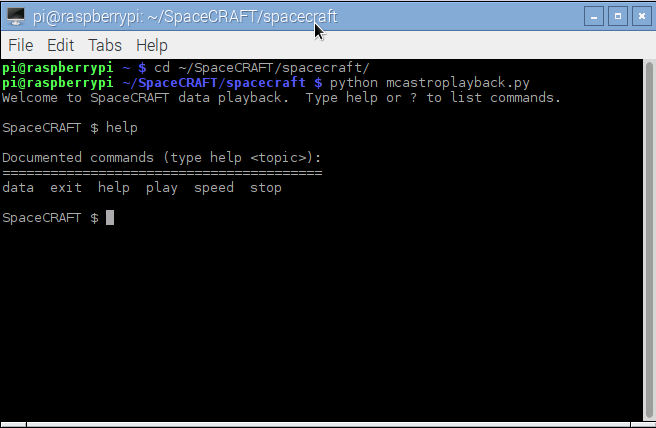

## SpaceCRAFT - playback captured data 

The data captured captured from the Sense HAT can be displayed in Minecraft, using the SpaceCRAFT playback `mcastroplayback.py` program.

--- task ---

Start Minecraft, enter a world and press **Escape** to go to the menu.

--- /task ---

--- task ---

Open a terminal and enter the following commands to start the data playback program:

```
cd ~/SpaceCRAFT/spacecraft
python3 mcastroplayback.py
```

--- /task ---

The SpaceCRAFT playback program will start and wait for you to enter a text-based command just like when using the terminal.

--- task ---

Type `help` at the `SpaceCRAFT $` prompt to see a list of all the commands:

```
Welcome to SpaceCRAFT data playback.  Type help or ? to list commands.

SpaceCRAFT $ help

Documented commands (type help <topic>):
========================================
data  exit  help  play  speed  stop
```



--- /task ---

--- task ---

Use the `play` command to display the data you captured to the `data.csv` file.

```
play /home/pi/data.csv
```


--- /task ---

The SpaceCRAFT display will appear in Minecraft and playback the data.

You can stop the playback at anytime by entering the `stop` command.

To exit the program use the command `exit`.

