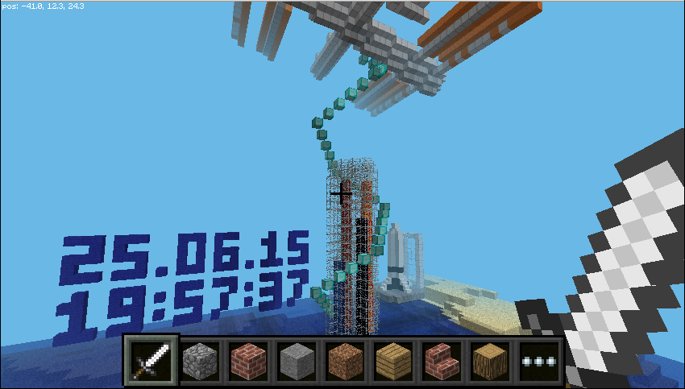

## Displaying data from the Sense HAT in Minecraft

SpaceCRAFT displays data from the SenseHAT in Minecraft, converting the data into 3D structures and blocks.

This can be run at any time and will use live data from the SenseHAT, allowing you to see the results instantly in Minecraft.

