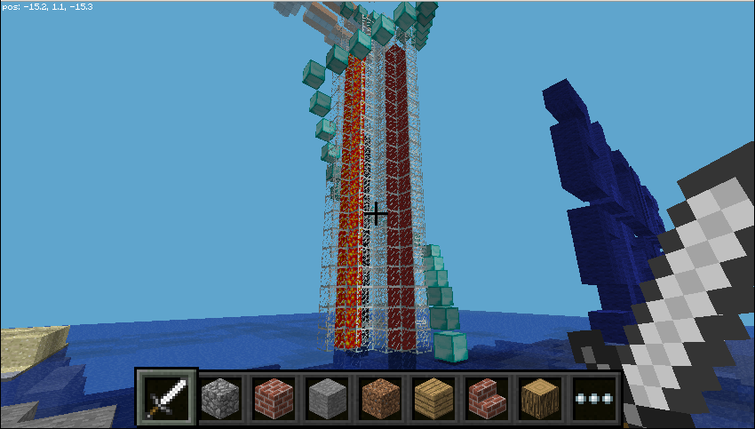
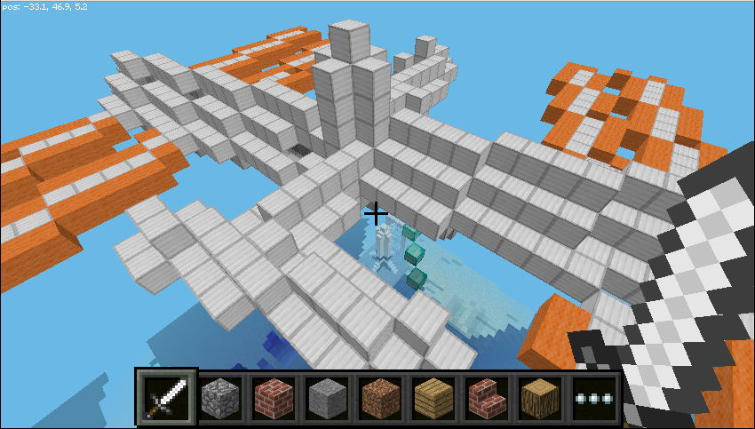
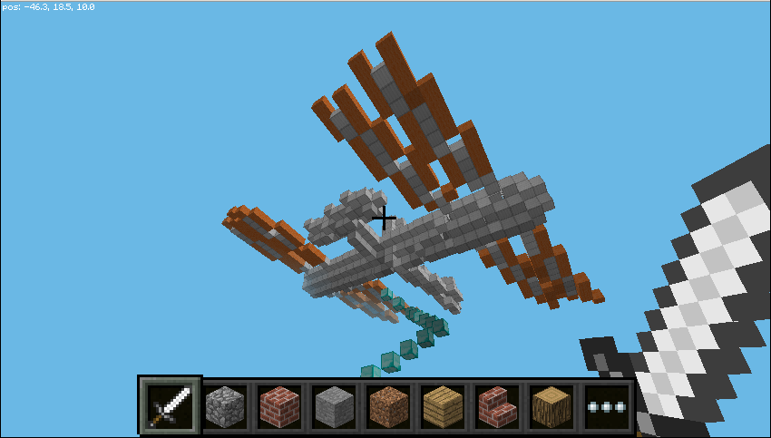
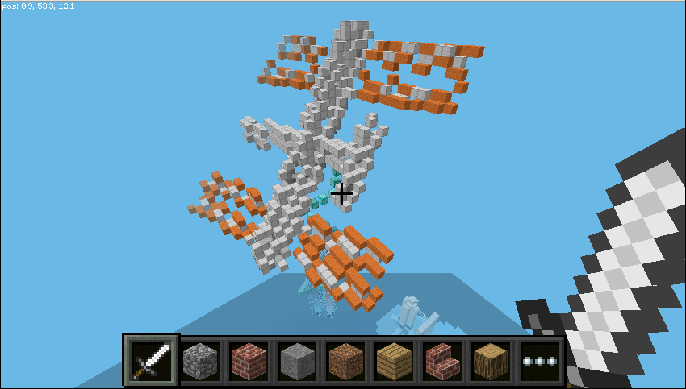
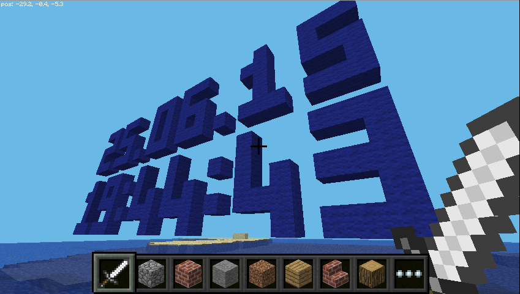
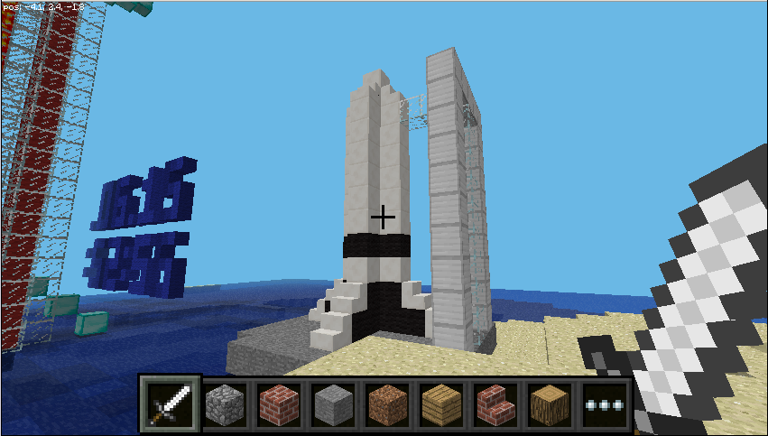
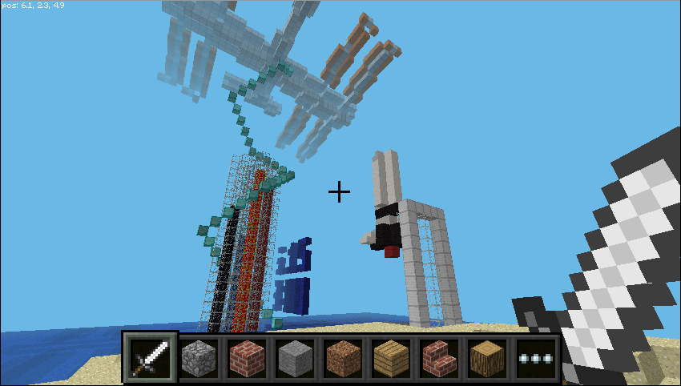

## Explore the SpaceCRAFT data

### The four pillars

The four pillars running up the centre of the display show data from the temperature, humidity and pressure sensors on the Sense HAT and its CPU temperature.

Along the centre of each pillar is a different type of block representing the different sensors:

* Lava - temperature
* Water - humidity
* Obsidian - pressure
* Red wool - CPU temperature 

Try holding your finger over the temperature sensor or breathing on the humidity sensor, and seeing what effect it has on the level of lava or water in the pillars.

### The ISS

The ISS at the top of the stairs which circle the pillars changes position based on the orientation of the Sense HAT. This is calculated using the Sense HAT's accelerometer, gyroscope, and magnetometer.

Tilt the Sense HAT and see the effect it has on the ISS.

### The date and time

The date and time is displayed by a large clock on the left of the display. When run live, it will show the current time set on the computer; when playing back data capture from the ISS, it will show the date and time the information was captured.

The date and time is displayed in the format DD.MM.YY HH:MM:SS (day . month . year  hours : minutes : seconds).

### Rocket

The rocket will be launched when the joystick is used.

