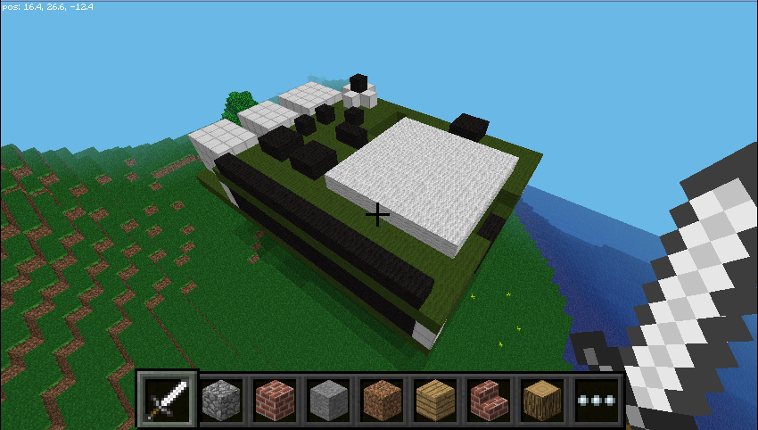
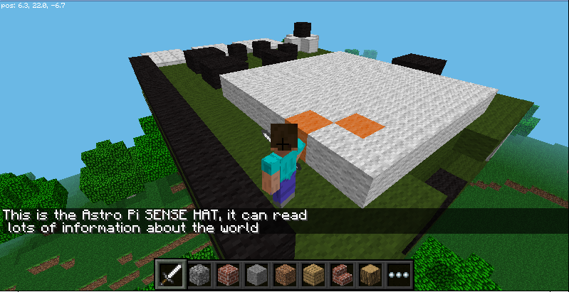
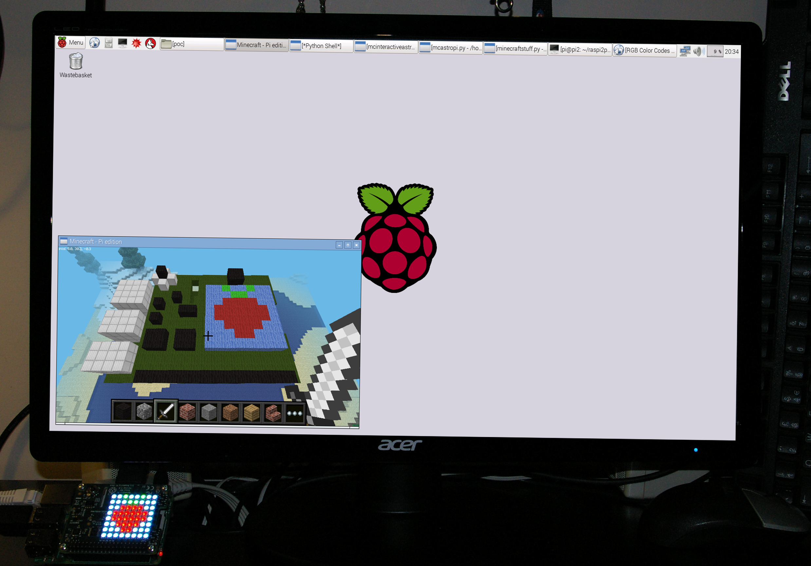

# Exploring the Sense HAT in Minecraft

SpaceCRAFT includes a program which creates an interactive Sense HAT and Raspberry Pi computer in Minecraft. This is a great way to explore your Raspberry Pi computer, its Sense HAT and what it can do.



You can watch a video of the interactive Sense HAT in operation [here](https://youtu.be/i4sAfVcE_9s).

## Run Minecraft

Run Minecraft by clicking `Menu > Games > Minecraft Pi`.

Click `Start Game` and enter a world by either double-clicking a world you have already created or selecting `Create new`.

Leave Minecraft running, press `Escape` to go to the menu and release your mouse pointer.

## Run the interactive Sense HAT program

Open a terminal by clicking the icon on the taskbar, or by clicking `Menu > Accessories > Terminal`, and enter the following commands one by one, pressing `Enter` after each command:

```
cd ~/SpaceCRAFT/spacecraft
python3 mcinteractiveastropi.py
```

The interactive Sense HAT will be created directly above the player's position. If you go back to Minecraft and look up, you should see the bottom of the Raspberry Pi. 

## Explore the Sense HAT

After the Sense HAT has appeared in Minecraft, fly up and have a look around. Double-tap `Space` to fly, press `Space` to make the player go up, and press `Shift` to make the player come down.

You can interact with the Astro Pi by hitting it (right-clicking) with a sword. Every part of the Sense HAT computer can be hit and when you do, a message will be displayed in Minecraft telling you about what you hit.  



Can you find all of the parts on the Sense HAT?

### Sensors

If you hit the sensors, a message will appear in Minecraft, telling you what sensor it is and its current value.

Scout around and see if you can find all of the sensors - temperature, humidity, pressure, accelerometer, magnetometer, and gyroscope.

### LED matrix

Using the Sense HAT in Minecraft you can make the LED matrix on your Sense HAT light up. When you hit the LED matrix in Minecraft, the colour of the blocks will change and the LED will change to the same colour.



### Joystick

The joystick can also be hit, and will move the Sense HAT around the Minecraft world. 

## What next?

Now move on to [worksheet 2](worksheet2.md) to learn how to display data from the Sense HAT in Minecraft.
