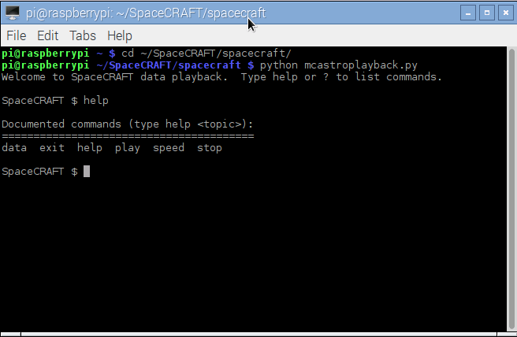
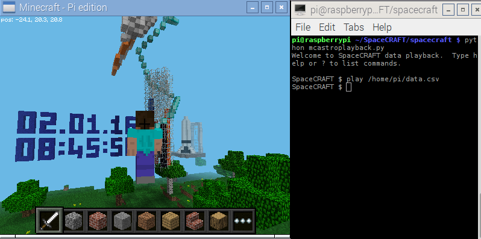

# Playing back data captured by the Sense HAT

Data captured to a [file by SpaceCRAFT running on the ISS](data/SpaceCRAFT_20160209_104426.csv) or [by your own Raspberry Pi computer](worksheet3.md) can be played back in Minecraft, using the SpaceCRAFT playback `mcastroplayback.py` program.

## Run Minecraft

Run Minecraft by clicking `Menu > Games > Minecraft Pi`.

Click `Start Game` and enter a world by either double-clicking a world you have already created or selecting `Create new`.

Leave Minecraft running, press `Escape` to go to the menu and release your mouse pointer.

## Run the playback program

Open a terminal by clicking `Menu > Accessories > Terminal` and enter the following commands to start the data playback program:

```
cd ~/SpaceCRAFT/spacecraft
python3 mcastroplayback.py
```



## Commands

The SpaceCRAFT playback program has a command line interface; you operate it using text-based commands just like when using the terminal.

Type `help` at the `SpaceCRAFT $` prompt to see a list of all the commands:

```
Welcome to SpaceCRAFT data playback.  Type help or ? to list commands.

SpaceCRAFT $ help

Documented commands (type help <topic>):
========================================
data  exit  help  play  speed  stop
```

## Playing back the data in a file

Download the [SpaceCRAFT data file](data/SpaceCRAFT_20160209_104426.csv) which was created on the ISS, or use the [data capture program](worksheet3.md) to create a data file, then use the `play` command and the full file path of the data file to start the Minecraft display, for example:

```
play /home/pi/data.csv
```



## Stopping playback

To stop the playback, use the `stop` command.

## Exiting the program

To exit the program, use the `exit` command.

## Other commands

Try the other SpaceCRAFT playback commands to see what they do:
* `speed`
* `data`

## What's Next?
- If you want to explore data logging with the Sense HAT a little more, have a look at the [Sense Hat Data Logger resource](https://www.raspberrypi.org/learning/sense-hat-data-logger/)
- If you wanr to have more fun with the world of Minecraft, have a look at the [Minecraft Photobooth resource](https://www.raspberrypi.org/learning/minecraft-photobooth/)
