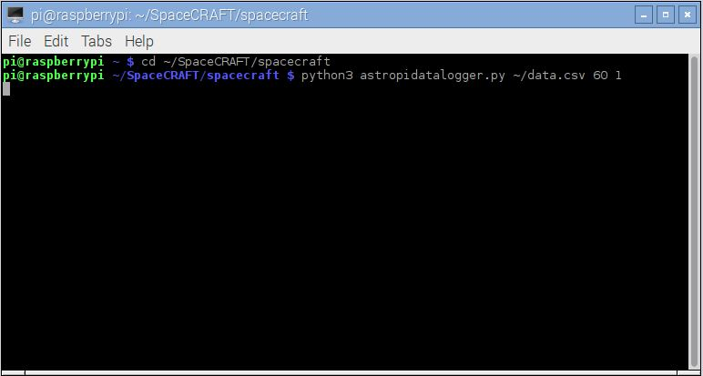
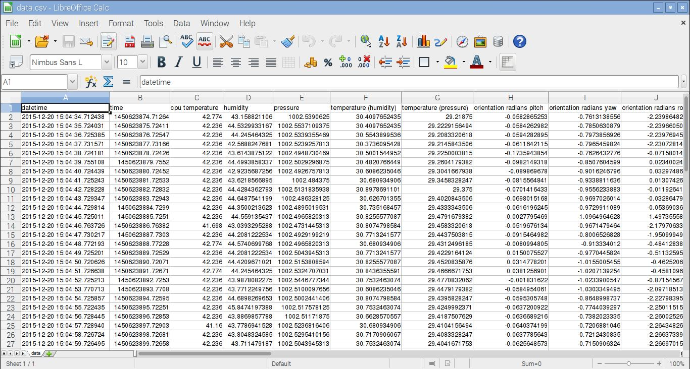
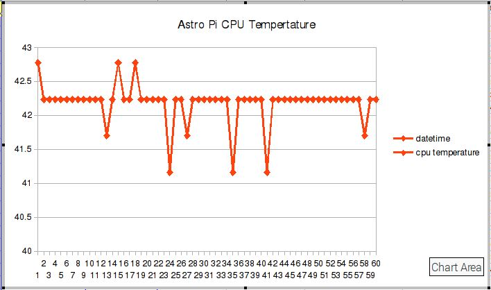

# Capturing data from the Astro Pi computer

While the Astro Pi computers are on the ISS, Tim Peake will be running the SpaceCRAFT data capture program which will create a file of data from all of its sensors and these files will eventually make their way back to Earth, allowing you to get a look at what conditions are like on the ISS.

You can use your Raspberry Pi and Sense HAT in the same way to capture data about your environment whether thats in your home, classroom or anywhere else you can find to set it up.

## Run the data capture program

The SpaceCRAFT data capture program needs to be run from the command line and passed a number of parameters telling it how long to run for, how often to read data and where to create the data file.

Open a terminal by clicking `Menu > Accessories > Terminal` and enter the following commands to run a short test, which will capture data to a file called `data.csv` for 60 seconds, every 1 second:

```
cd ~/SpaceCRAFT/spacecraft
python3 astropidatalogger.py ~/data.csv 60 1
```



While the program is running, an animation, created by Hannah Belshaw, will be shown on the Sense HAT LED Matrix, the pattern changing each time data is read from the sensors and written to the file.

The program will run for 60 seconds.

## Examine the data

The data from the sensors has been written to a [CSV (Comma Seperated Variable) file](TODO http link to wikipedia about CSV) which is a really common way of storing data and can be opened using a spreadsheet application, including Libre Office Sheets (TODO < check this is correct) installed on Raspbian.

Open the file using Libre Office Sheets and have a look at the data:
1. Open Libre Office Sheets by clicking `Menu > Office > LibreOffice Calc`
1. Click `File > Open`
1. Select `All Files`
1. Double click `data.csv`
1. Click `Ok` on the Text Import window.



The top row is the name of the field, each row after this is 1 line of data.

Challenge - can you use the Spreadsheet to create a line graph of the temperature over time?

 

## Command Line Options

The data capture program requires you to pass a number of parameters which tells it how to run and where to save the data, if you run the program using the optional `-h` parameter: 

```
python3 astropidatalogger.py -h
```

It will display all of the available options:

```
usage: astropidatalogger.py [-h] [-v] filename timetorun interval

Astro Pi Data Logger

positional arguments:
	filename       The output filename
	timetorun      The time in seconds the logger should run for
	interval       The time in seconds between each write

optional arguments:
	-h, --help     show this help message and exit
	-v, --verbose  Output verbose debug statements

```

When you ran the data capture program, you passed 3 parameters:
1. filename( - `~/data.csv`
1. timetorun - `60`
1. interval - `1`

These parameters have to be passed to the program, but can be changed to make write to a different file, run longer or read data less often, e.g. to run the program writing to a file called `hannahsdata.csv` for 30 minutes (1,800 seconds) reading data once a minute (60 seconds) you would use the command:

```
python3 astropidatalogger.py ~/hannahsdata.csv 1800 60
```

Caution - if you use the name of a file which already exists it will be overwritten without warning and the old data file will be lost.

## Worksheets
1. *[Installing SpaceCRAFT](installspacecraft.md)*
2. *[Exploring the Astro Pi computer using Minecraft](interactiveastropi.md)*
3. *[Displaying data from Space in Minecraft](displayingrealtimedata.md)*
4. *[Capturing data](capturingdata.md)*
5. [Playing back data in Minecraft](playbackdata.md)
6. [Creating your own Minecraft display](minecraftdisplay.md)
