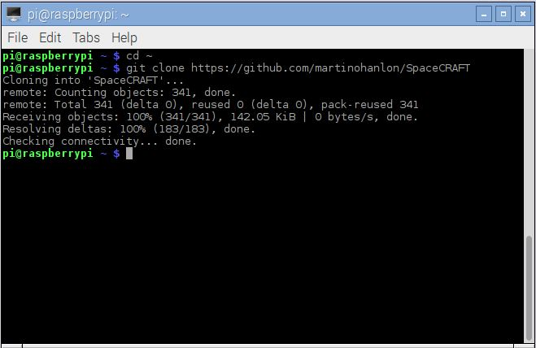
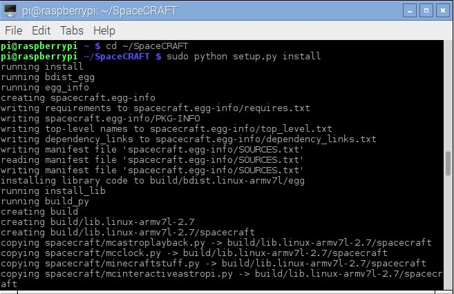

# Install SpaceCRAFT

The SpaceCRAFT programs and python module, need to be downloaded and installed before they can be used.

## Download

Open a Terminal by clicking the icon on the taskbar, or by clicking `Menu > Accessories > Terminal' (TODO - check this) and enter the following commands one by one pressing Enter after each:

```
cd ~
git clone https://github.com/martinohanlon/SpaceCRAFT
```



##Install the python library

As well as the SpaceCRAFT programs, a python library is also included to allow you to create your own SpaceCRAFT programs.

Open a terminal and enter the following commands:

```
cd ~/SpaceCRAFT
sudo python setup.py install
sudo python3 setup.py install
```



The SpaceCRAFT program and module documentation is here [https://github.com/martinohanlon/SpaceCRAFT/blob/master/README.rst](https://github.com/martinohanlon/SpaceCRAFT/blob/master/README.rst).

## Worksheets
1. *[Installing SpaceCRAFT](installspacecraft.md)*
2. [Exploring the Astro Pi computer using Minecraft](interactiveastropi.md)
3. [Displaying data from Space in Minecraft](displayingrealtimedata.md)
4. [Capturing data](capturingdata.md)
5. [Playing back data in Minecraft](playbackdata.md)
6. [Creating your own Minecraft display](minecraftdisplay.md)
